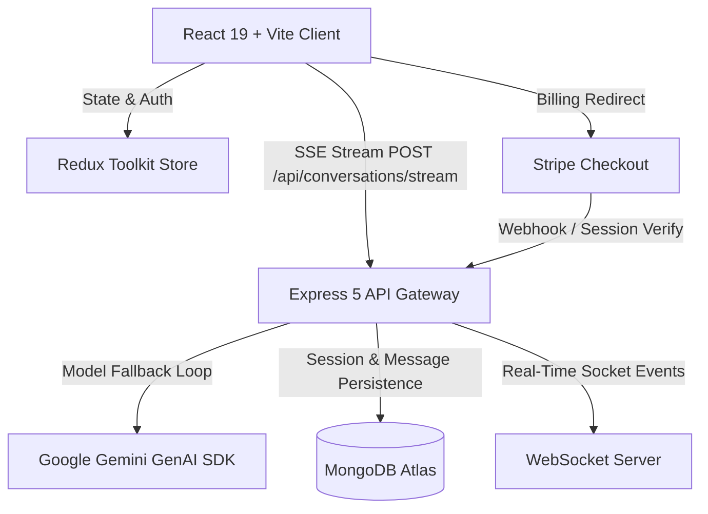

# 🚀 Nexora AI — Full-Stack AI Chat & Collaborative Workspace (Frontend)

[](https://react.dev/)
[](https://vitejs.dev/)
[](https://tailwindcss.com/)
[](https://redux-toolkit.js.org/)
[](https://ai.google.dev/)
[](https://stripe.com/)

Nexora AI is a modern, high-throughput MERN-stack web application designed for low-latency conversational AI and real-time team messaging. It features token-by-token Server-Sent Events (SSE) streaming with Google Gemini, full MongoDB session persistence, an interactive analytics dashboard with historical chat viewing, and Stripe subscription tiering.

---


## 📸 Key Highlights & Features

- **⚡ Real-Time SSE Token Streaming**: Ultra-low-latency response generation using Server-Sent Events with rich Markdown formatting and Prism syntax-highlighted code blocks.
- **🛡️ Resilient AI Model Failover**: Automatic multi-tier model fallback (`gemini-3.5-flash`, `gemini-3.5-flash-lite`, `gemini-flash-latest`, `gemini-3.8-flash`) that mitigates API rate spikes and 503 high-demand errors transparently.
- **📊 Analytics & Chat History Sidebar**: Interactive user dashboard featuring 7-day conversational volume metrics, token & storage estimators, live keyword search, and an inline **Previous Chat Viewer** modal.
- **💳 Stripe Subscription Integration**: Complete billing flow with Stripe Checkout, tier upgrades (Free, Pro Developer, Enterprise), dynamic plan quotas, and automated session verification.
- **🎨 Modern Glassmorphic UI**: Tailored dark/light mode engine, responsive sidebar drawers, animated particle canvases, and Google Geist typography.
- **🔒 Secure Authentication & State Management**: JWT HTTP-only cookie authentication paired with Redux Toolkit for global user and conversation state.

---

## 🧠 System Architecture Overview



---

## 🛠️ Tech Stack & Technologies

### Frontend Architecture
| Layer | Technology | Purpose |
| :--- | :--- | :--- |
| **Framework** | React 19.x & Vite 8.x | Lightning-fast HMR and optimized production bundling |
| **State Management** | Redux Toolkit (`@reduxjs/toolkit`) | Centralized auth, user profiles, and active session caching |
| **Routing** | React Router DOM v7 | Dynamic client-side routing with `ProtectedRoute` guards |
| **Styling & Theme** | Tailwind CSS + Custom CSS Variables | Fully customizable dark/light theme engine & micro-animations |
| **Rendering & Syntax** | `react-markdown` + `react-syntax-highlighter` | Markdown rendering with GitHub dark theme and code copy action |
| **Networking** | Axios + Native Fetch API | REST requests and ReadableStream SSE consumption |
| **Icons & Alerts** | `react-icons`, `lucide-react`, `react-toastify` | Accessible UI iconography and responsive notifications |

### Backend Component Summary
| Layer | Technology | Purpose |
| :--- | :--- | :--- |
| **Runtime & Server** | Node.js & Express 5.x | High-concurrency REST & SSE streaming server |
| **AI Inference** | `@google/genai` (Google GenAI SDK) | Direct integration with Google Gemini model family |
| **Database** | MongoDB Atlas via Mongoose 9.x | Scalable document storage for users, chats, and analytics |
| **Payments** | Stripe Node SDK | Subscription checkouts, webhooks, and entitlement controls |
| **Security** | `jsonwebtoken`, `bcryptjs`, `cookie-parser` | Tamper-proof HTTP-only cookie session authentication |

---

## 💡 The Most Challenging Aspect & How It Was Resolved

### 🔴 The Challenge: Multi-Turn SSE Token Streaming Resilience under AI High-Demand Spikes
During heavy traffic periods on AI provider endpoints, cloud LLMs frequently emit `503 UNAVAILABLE` ("This model is currently experiencing high demand") or 404 deprecation errors. 

Because `@google/genai` stream responses return **asynchronous generator iterators**, the network error is often not triggered upon function invocation, but rather **lazily when the client begins reading the first chunk** (`for await (const chunk of stream)`). In traditional architectures:
1. Standard try/catch blocks fail to catch errors during stream creation.
2. The SSE response headers are already flushed to the browser, resulting in broken streams, corrupted message histories in MongoDB, and frontend crashes.

### 🟢 The Resolution: Adaptive Zero-Downtime Stream Fallback Pipeline
To eliminate stream disruptions, an adaptive pre-emission fallback architecture was implemented across the backend and frontend:

1. **Pre-Emission Model Fallback Pipeline**:
   - An ordered candidate fallback chain (`gemini-3.5-flash` → `gemini-3.5-flash-lite` → `gemini-flash-latest` → `gemini-3.8-flash`) was established.
   - The stream iteration is wrapped in a candidate model loop. If the active model fails on chunk 0 (before any tokens are written to the wire), the error is intercepted and the engine automatically switches to the next high-throughput model in **under 300ms**, with zero disruption to the user.
2. **Resilient Sliding Window Context**:
   - Historical conversation turns are normalized and sanitized into strictly alternating `user`/`model` sequences to adhere to Gemini API constraints.
3. **Optimistic SSE Consumer Hook (`useAiChat.js`)**:
   - The custom React hook reads the chunk buffer incrementally, handling partial JSON frames safely and persisting conversation IDs without unmounting active streams.

```javascript
// Resilient Candidate Fallback Loop in conversation.controllers.js
for (const currentModel of candidateModels) {
  if (!isConnected) break;
  try {
    const stream = await ai.models.generateContentStream({
      model: currentModel,
      contents,
      config: systemInstruction ? { systemInstruction } : undefined,
    });

    for await (const chunk of stream) {
      if (!isConnected) break;
      if (chunk.text) {
        accumulatedText += chunk.text;
        res.write(`data: ${JSON.stringify({ text: chunk.text })}\n\n`);
      }
    }
    selectedModel = currentModel;
    streamSuccess = true;
    break; // Stream completed cleanly
  } catch (streamErr) {
    if (accumulatedText.trim().length > 0) break; // Don't mix streams mid-sentence
    // Seamlessly step to next candidate model
  }
}
```

---

## 📂 Project Directory Structure

```text
chatprojects/
├── frontend/                     # React 19 Client Application
│   ├── src/
│   │   ├── components/
│   │   │   ├── chat/             # AiChatBox, PreviousChatViewer, ChatSidebar, MessageList
│   │   │   ├── common/           # SEO, LoadingSpinner, ErrorState
│   │   │   ├── layout/           # Navbar, Footer, PageLayout
│   │   │   └── ui/               # ThemeToggle, UserAvatar, Modal wrappers
│   │   ├── customHooks/          # useAiChat.js (SSE streaming & session management)
│   │   ├── pages/                # Dashboard, Pricing, Chat, Settings, Auth, Payment
│   │   ├── redux/                # userSlice, chatSlice, store configuration
│   │   ├── App.jsx               # Route definitions & ProtectedRoute wrappers
│   │   └── main.jsx              # Application root
│   ├── package.json
│   └── vite.config.js
│
└── backend/                      # Express 5 API & SSE Streaming Service
    ├── src/
    │   ├── controllers/          # conversation, pricing, dashboard, auth, user
    │   ├── db/                   # MongoDB connection management
    │   ├── middlewares/          # isAuth (JWT cookie authentication)
    │   ├── models/               # User, Conversation, Message schemas
    │   ├── routes/               # API endpoint routing
    │   └── index.js              # Server entrypoint
    └── package.json
```

---

## ⚙️ Getting Started Locally

### Prerequisites
- **Node.js**: `v18.x` or higher
- **MongoDB**: Active MongoDB Atlas connection URI or local instance
- **Google AI Studio Key**: API key for Gemini models ([Get key](https://aistudio.google.com/))
- **Stripe Account**: Secret key for checkout flows ([Stripe Dashboard](https://dashboard.stripe.com/))

---

### 1. Backend Setup

```bash
# Navigate to backend directory
cd backend

# Install dependencies
npm install

# Create environment configuration (.env)
cp .env.example .env
```

Ensure your `backend/.env` contains:
```env
PORT=8000
MONGO_DB_URL=your_mongodb_connection_string
JWT_SECRET=your_jwt_secret_key
GOOGLE_API_KEY=your_gemini_api_key
STRIPE_SECRET_KEY=sk_test_your_stripe_secret_key
CLIENT_URL=http://localhost:5173
```

Start the backend server:
```bash
npm run dev
```

---

### 2. Frontend Setup

```bash
# Navigate to frontend directory
cd ../frontend

# Install dependencies
npm install

# Create environment configuration (.env)
cp .env.example .env
```

Ensure your `frontend/.env` contains:
```env
VITE_SERVER_URL=http://localhost:8000
```

Start the frontend development server:
```bash
npm run dev
```

Open [http://localhost:5173](http://localhost:5173) in your browser.

---

## 🧪 Production Build Verification

To verify production bundling and linting:

```bash
cd frontend
npm run build
```

---

## 👤 Author & Acknowledgments

- **Lead Developer**: Full-Stack Software Engineer
- **AI Infrastructure**: Powered by Google Gemini (`@google/genai`)
- **Payments**: Powered by Stripe Checkout & Webhooks
